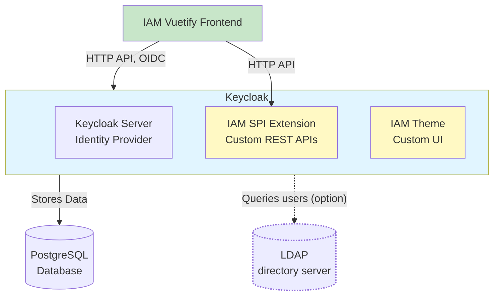
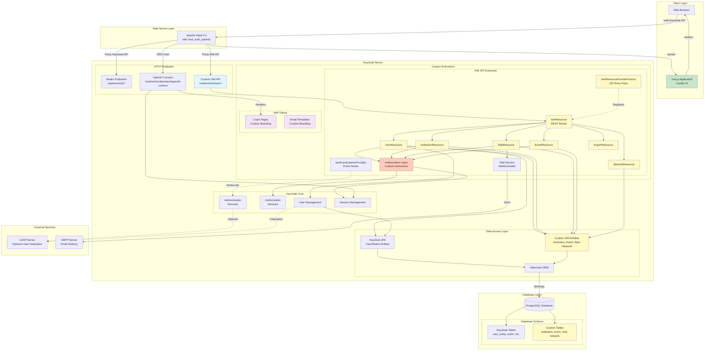

# Identity management for IMIS applications

The IMIS3 Identity Management system serves as central identity and access management for the IMIS
("Integrated Measuring and Information System for the Surveillance of Environmental Radioactivity") applications of the
German Federal Office for Radiation Protection.

## Overview

The system is built on Keycloak with custom extensions and a Vue.js frontend.
It provides user authentication, authorization, and comprehensive user/institution management capabilities for the IMIS ecosystem.

### Architecture

The application has two main components:

- **Frontend**: Vue 3 Single Page Application (SPA) with Vuetify Material Design components
- **Backend**: Keycloak identity provider, extended with custom REST APIs via the Service Provider Interface (SPI)

#### High-Level System Architecture



**Key Components:**
- **Vue.js Client**: Single-page application providing user interface
- **Keycloak Server**: Handles authentication, authorization, and session management
- **IAM SPI Extension**: Custom REST APIs for user, institution, event, and mail management
- **IAM Theme**: Custom theming for login pages and email templates
- **PostgreSQL Database**: Stores Keycloak data and IAM entities
- **LDAP directory server**: Optionally use an LDAP server for user federation to integrate more users.


#### Detailed Architecture

The following diagram illustrates how the frontend, the custom IAM SPI and the IAM Theme integrate into Keycloak's architecture:



#### Key Integration Points

1. **SPI Extension Registration**
   - `IamResourceProviderFactory` implements Keycloak's SPI factory pattern
   - Registered via META-INF services, loaded at Keycloak startup
   - Provides custom REST resources under `/realms/imis3/iam/*` endpoint

2. **Custom REST Resources**
   - Extends Keycloak's REST API with IAM-specific endpoints
   - Accesses Keycloak's session, user, and realm information

3. **Custom JPA Entities**
   - Defines additional database tables alongside Keycloak's own schema

4. **Custom Keycloak Themes**
   - Override default Keycloak login pages and email templates
   - Customizes branding while maintaining OIDC flow

5. **Event Listener Hooks**
   - `IamEventListenerProvider` receives Keycloak lifecycle events
   - Triggers on user login, logout, registration, etc.

### Technology Stack

#### Frontend
- **Framework**: Vue 3 using Vite as build tool
- **UI Library**: Vuetify 3 and Material Design
- **State Management**: Pinia
- **Routing**: Vue Router 4
- **HTTP Client**: Axios
- **Styling**: SCSS
- **Testing**: Vitest

#### Backend
- **Identity Provider**: Keycloak
- **Language**: Java 21
- **Build Tool**: Maven 17
- **API Framework**: Jakarta REST (JAX-RS)
- **ORM**: Hibernate/JPA (via Keycloak)
- **Database**: PostgreSQL
- **Validation**: Hibernate Validator

#### DevOps
- **Containerization**: Docker with multi-stage builds
- **Orchestration**: Docker Compose
- **Web Server**: Apache httpd 2.4 with `mod_auth_openidc`
- **Testing**: pytest (backend), Vitest (frontend), Selenium (integration)

### Directory Structure

```
imis3_identity_management/
├── client/                  # frontend application
│   ├── src/
│   │   ├── App.vue          # Base application setup
│   │   ├── components/      # Vue components
│   │   ├── i18n/            # Internationalization config
│   │   ├── lib/             # Utilities
│   │   ├── license/         # License header templates
│   │   ├── locales/         # Translation files
│   │   ├── main.js/         # Base application setup
│   │   ├── plugins/         # Vuetify plugin config
│   │   ├── router/          # Router configuration
│   │   ├── stores/          # State management
│   │   └── test/            # Vitest unit tests
│   ├── public/              # Public files (favicon)
│   └── package.json         # Dependency management
├── keycloak/
│   ├── iam_spi/             # Custom Keycloak SPI extension
│   │   └── src/main/
│   │       ├── java/de/intevation/iam/
│   │       │   ├── auth/    # Authorization layer
│   │       │   ├── jaxrs/   # Parameter converters
│   │       │   ├── mail/    # Email functionality
│   │       │   ├── model/   # JPA entities and DTOs
│   │       │   ├── util/    # Custom validators
│   │       │   ├── validation/  # Custom validators
│   │       │   └── *.java   # REST resources
│   │       └── resources
│   │           ├── META-INF/ # database extensions and Keycloak hooks
│   │           └── *.properties # Settings and Translation files
│   ├── iam_theme/           # Custom Keycloak theme
│   │   ├── email/           # Email templates
│   │   └── login/           # Login theme
│   └── pom.xml              # Dependency management
├── docker/                  # Docker Compose orchestration
│   ├── dev.env              # Settings for development setup
│   ├── docker-compose.yml   # Production setup
│   ├── docker-compose.dev.yml  # Development setup
│   └── */                   # Container configuration, build and setup scripts
├── tests/                   # Automated tests
│   ├── backend/             # Backend API tests
│   ├── frontend/            # Integration and frontend tests
│   └── lib/
├── LICENSES/                # Copy of all licenses
└── CHANGELOG.md
```

## Components

All components are orchestrated by a Docker Compose setup (`docker/`).

### Backend
[Keycloak](https://www.keycloak.org/) is used as central identity provider.
Specific requirements for user attributes can be met by configuring
the [User Profile](https://www.keycloak.org/docs/latest/server_admin/index.html#user-profile).
For requirements that cannot be met by User Profile configuration,
custom [JPA entities](https://www.keycloak.org/docs/latest/server_development/index.html#_extensions_jpa) are added as an extension (`keycloak/iam_spi/`).
The same extension also provides [REST interfaces](https://www.keycloak.org/docs/latest/server_development/index.html#_extensions_rest)
for the management of these specific aspects.

### Client
A client based on [Vue.js](https://vuejs.org) and [Vuetify](https://vuetifyjs.com)
provides a GUI for REST interfaces provided by the backend (`client/`).

## Development

### Local Development Setup
See `docker/README.md`

### Building

#### Frontend
See `client/README.md`

#### Backend SPI
See `keycloak/iam_spi/README.md`

### Testing
See `tests/README.md`.

## License

This software is licensed under GPL version 3.0 or later.
It includes one file licensed under Apache 2.0:
`keycloak/iam_spi/src/main/java/de/intevation/iam/util/SearchQueryUtils.java`

A copy of both license texts is included in directory [`LICENSES`](./LICENSES/)
